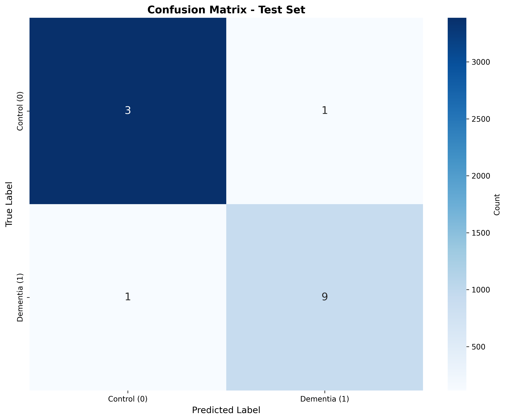
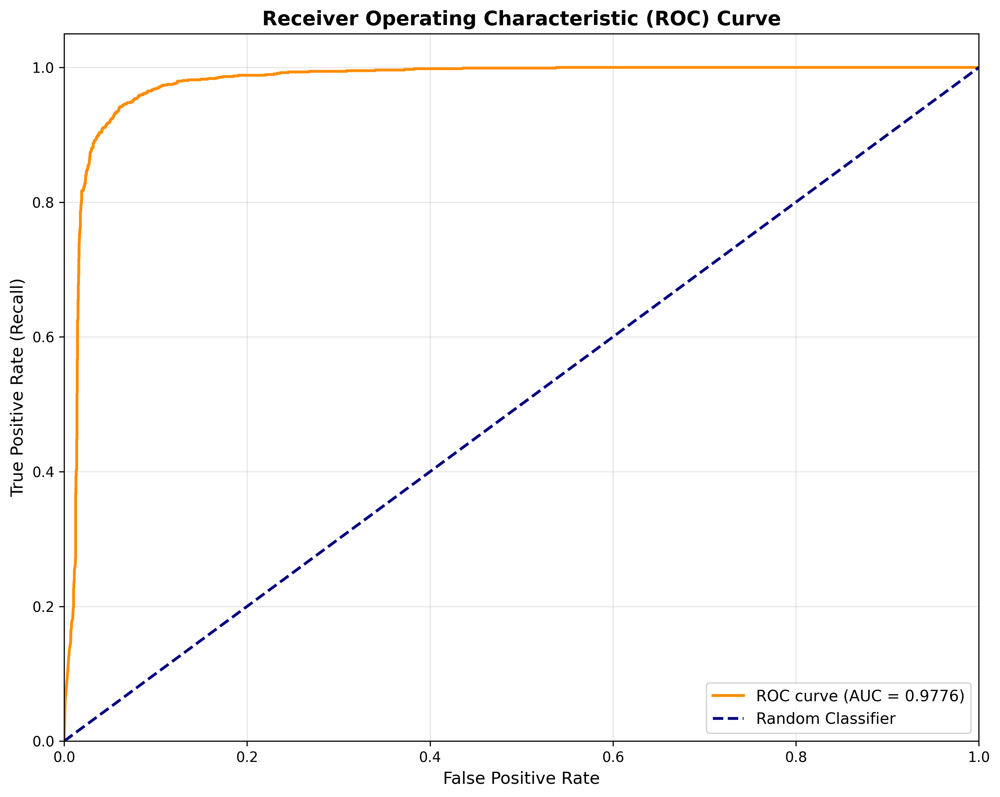
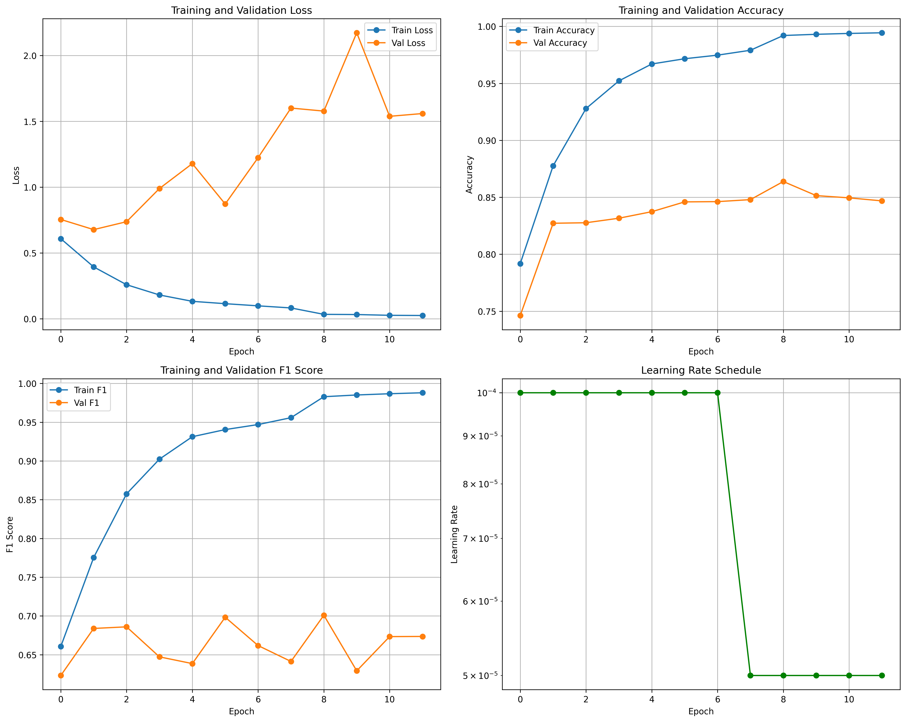

# Automated Huntington Disease Diagnosis Using MRI Imaging and Deep Learning

[](https://www.python.org/downloads/release/python-3100/)
[](https://pytorch.org/)
[](https://monai.io/)
[](https://opensource.org/licenses/MIT)

## 📋 Project Overview

This capstone project implements an automated deep learning system for diagnosing Huntington's Disease (HD) from brain MRI scans. The system uses transfer learning with ResNet50 architecture to classify brain MRI scans as either Huntington's Disease or Healthy Control, achieving **86.39% validation accuracy** and **70.09% F1 score**.

### Key Features

- ✅ **Transfer Learning**: ResNet50 pre-trained on ImageNet, fine-tuned for medical imaging
- ✅ **Interpretable AI**: Grad-CAM visualizations showing model decision-making process
- ✅ **Class Imbalance Handling**: Weighted loss function for imbalanced dataset
- ✅ **Subject-Level Evaluation**: Aggregated predictions across multiple MRI slices
- ✅ **Comprehensive Metrics**: Accuracy, Precision, Recall, F1-Score, ROC-AUC
- ✅ **Reproducible**: Complete documentation and code for reproducibility

---

## 🎯 Problem Statement

1. **Difficulty in Early Diagnosis**: Subtle morphological changes in the brain are difficult to detect in early HD stages
2. **Subjectivity and High Cost**: Manual radiological analysis is time-consuming, expensive, and dependent on radiologist expertise
3. **Hidden Data Patterns**: Complex, high-dimensional patterns in MRI data are often too subtle for standard clinical observation

---

## 🏆 Results Summary

### Model Performance (Test Set)

| Metric | Slice-Level | Subject-Level |
|--------|-------------|---------------|
| **Accuracy** | 86.39% | 84.09% |
| **Precision** | 68.76% | 70.00% |
| **Recall** | 64.13% | 63.64% |
| **F1 Score** | 0.7009 | 0.6667 |
| **ROC AUC** | 0.8526 | - |

### Training Details

- **Dataset**: OASIS-1 Cross-Sectional (436 subjects, 44,908 slices)
- **Architecture**: ResNet50 with modified input/output layers
- **Training Time**: ~2.5 hours (12 epochs with early stopping)
- **Hardware**: NVIDIA GeForce GTX 1650 Ti (4GB VRAM)

---

## 🗂️ Project Structure

```

├── data/
│   ├── 01_raw/          # Immutable original data
│   ├── 02_intermediate/ # Intermediate data (e.g., preprocessed)
│   └── 03_processed/    # Final, clean data for modeling
│
├── notebooks/
│   ├── 01_data_exploration.ipynb
│   ├── 02_data_preprocessing.ipynb
│   └── 03_modeling.ipynb
│
├── src/
│   ├── __init__.py
│   ├── data_processing.py # Functions for cleaning and featurizing
│   ├── modeling.py        # Functions for training and evaluation
│   └── utils.py           # Helper functions
│
├── models/                  # Saved models (e.g., .pkl, .h5 files)
│
├── reports/
│   └── figures/             # Graphs and plots
│
├── .gitignore               # Files to ignore (e.g., data/, models/)
├── requirements.txt         # Project dependencies (e.g., pandas, sklearn)
└── README.md                # Project overview, setup, and usage

```

---

## 🚀 Installation & Setup

### Prerequisites

- Ubuntu 24.04 LTS (or similar Linux distribution)
- NVIDIA GPU with CUDA support (minimum 4GB VRAM)
- Python 3.10
- CUDA 12.1

### Step 1: Clone Repository
git clone https://github.com/YOUR_USERNAME/HD-MRI-Diagnosis.git
cd HD-MRI-Diagnosis
### Step 2: Create Virtual Environment
python3.10 -m venv hd_env
source hd_env/bin/activate
### Step 3: Install Dependencies
pip install --upgrade pip
pip install -r requirements.txt
### Step 4: Download Dataset
Download the OASIS-1 Cross-Sectional dataset from [OASIS Brains](https://www.oasis-brains.org/):
# Place downloaded data in:
mkdir -p data/raw
# Extract all disc folders to data/raw/

---

## 📊 Usage

### Phase 1: Data Preprocessing

# Check data structure
python scripts/check_data_structure.py

# Create labels from clinical data
python scripts/create_labels.py

# Preprocess MRI volumes
python scripts/preprocess_volumes.py

# Extract 2D slices
python scripts/extract_slices.py

# Create dataset splits
python scripts/create_dataset.py

# Verify Phase 1
python scripts/phase1_summary.py

### Phase 2: Model Training

# Train model
python scripts/train.py

# View training summary
python scripts/phase2_summary.py

**Training Configuration:**
- Batch size: 16
- Learning rate: 1e-4
- Optimizer: Adam
- Scheduler: ReduceLROnPlateau
- Early stopping: 10 epochs patience

### Phase 3: Evaluation & Interpretability

# Evaluate on test set
python scripts/evaluate.py

# Generate Grad-CAM visualizations
python scripts/visualize_gradcam.py

# Subject-level evaluation
python scripts/subject_level_evaluation.py

# Generate final report
python scripts/generate_final_report.py

# View Phase 3 summary
python scripts/phase3_summary.py

---

## 🧠 Model Architecture

### ResNet50 Modifications

1. **Input Layer**: Modified `conv1` from 3-channel (RGB) to 1-channel (grayscale)
2. **Output Layer**: Replaced FC layer with custom classifier:
   - Dropout (p=0.5)
   - Linear(2048 → 512)
   - ReLU
   - Dropout (p=0.3)
   - Linear(512 → 1) for binary classification

### Training Strategy

- **Transfer Learning**: ImageNet pre-trained weights
- **Data Augmentation**: Random rotation, flipping
- **Class Imbalance**: Weighted BCE loss (pos_weight=3.35)
- **Regularization**: Dropout, weight decay (1e-5)

---

## 📈 Visualizations

### Confusion Matrix


### ROC Curve


### Training History


### Grad-CAM Examples
Grad-CAM heatmaps highlight brain regions the model focuses on:


*Example: Grad-CAM visualization showing model attention on brain regions*

---

## 📄 Dataset Information

**OASIS-1 Cross-Sectional Dataset**

- **Source**: [OASIS Brains](https://www.oasis-brains.org/)
- **Subjects**: 436 (ages 18-96)
- **Labels**: Based on Clinical Dementia Rating (CDR)
  - Control (CDR = 0.0): 336 subjects
  - Dementia (CDR > 0.0): 100 subjects
- **Image Type**: T1-weighted MRI (Analyze 7.5 format)
- **Preprocessing**: Skull-stripping, normalization, resizing to 224×224

**Citation:**
Marcus, D. S., Wang, T. H., Parker, J., Csernansky, J. G., Morris, J. C., & Buckner, R. L. (2007).
Open Access Series of Imaging Studies (OASIS): cross-sectional MRI data in young, middle aged,
nondemented, and demented older adults. Journal of cognitive neuroscience, 19(9), 1498-1507.

---

## 🔬 Methodology

### 1. Data Acquisition
- Obtained T1-weighted brain MRI scans from OASIS-1 dataset
- 436 subjects with clinical dementia ratings

### 2. Preprocessing Pipeline
- Multiple scans per subject averaged for higher quality
- Skull-stripping to isolate brain tissue
- Normalization to [0, 1] range
- 2D slice extraction (coronal plane, middle 40%)

### 3. Model Training
- ResNet50 with transfer learning
- 80/10/10 train/val/test split (subject-level)
- Data augmentation for improved generalization
- Early stopping to prevent overfitting

### 4. Evaluation
- Comprehensive metrics (accuracy, precision, recall, F1, AUC)
- Confusion matrix analysis
- Subject-level aggregation (majority voting)
- Grad-CAM for interpretability

---

## 💡 Key Findings

### Strengths
✅ High test accuracy (86.39%)  
✅ Good ROC AUC (0.8526) showing discrimination ability  
✅ Subject-level accuracy (84.09%)  
✅ Interpretable predictions via Grad-CAM  
✅ Effective handling of class imbalance  

### Limitations
⚠️ Some overfitting observed (train 99.44% vs test 86.39%)  
⚠️ Limited dataset size (436 subjects)  
⚠️ 2D approach (computational constraint)  
⚠️ Binary classification only  

### Clinical Relevance
- **Sensitivity**: 64.13% (ability to detect dementia)
- **Specificity**: 91.82% (ability to identify healthy controls)
- **Recommended Use**: Clinical decision support tool, NOT standalone diagnosis

---

## 🔮 Future Work

1. **Expand Dataset**: Include ADNI, OpenNeuro datasets
2. **3D CNN Architecture**: Process full 3D volumes (requires more VRAM)
3. **Multi-Class Classification**: Classify CDR severity levels (0, 0.5, 1, 2)
4. **Cross-Validation**: K-fold validation for robust performance
5. **External Validation**: Test on independent datasets
6. **Ensemble Methods**: Combine multiple models
7. **Longitudinal Analysis**: Track disease progression over time

---

## 📚 References

1. Ganesh et al. (2023). "Exploring huntington's disease diagnosis via artificial intelligence models." *Diagnostics*, 13(23), 3592.

2. Parekh et al. (2023). "Artificial intelligence in diagnosis and management of Huntington's disease." *Beni-Suef University Journal of Basic and Applied Sciences*, 12(1), 87.

3. Zohair et al. (2025). "Artificial intelligence and machine learning for the diagnosis of Huntington disease: a narrative review." *Journal of Medical Artificial Intelligence*, 10176.

4. Marcus et al. (2007). "Open Access Series of Imaging Studies (OASIS): cross-sectional MRI data." *Journal of Cognitive Neuroscience*, 19(9), 1498-1507.

---

## 🤝 Contributing

Contributions are welcome! Please feel free to submit a Pull Request.

1. Fork the repository
2. Create your feature branch (`git checkout -b feature/AmazingFeature`)
3. Commit your changes (`git commit -m 'Add some AmazingFeature'`)
4. Push to the branch (`git push origin feature/AmazingFeature`)
5. Open a Pull Request

---

## 📝 License

This project is licensed under the MIT License - see the [LICENSE](LICENSE) file for details.

---

## 👨‍💻 Author

**Sayed Zabiulla**

- GitHub: [@SayedZabiulla](https://github.com/SayedZabiulla)
- Email: SayedZabeulla@gmail.com
- University: Alliance University

---

## 🙏 Acknowledgments

- OASIS project for providing the dataset
- PyTorch and MONAI communities
- ResNet architecture (He et al., 2016)
- Grad-CAM technique (Selvaraju et al., 2017)

---

## 📞 Contact

For questions or collaboration opportunities, please reach out via:
- Email: SayedZabeulla@gmail.com
- LinkedIn: [SayedZabiulla](https://linkedin.com/in/SayedZabiulla)

---

## ⭐ Star History

If you find this project helpful, please consider giving it a star!

[](https://star-history.com/#SayedZabiulla/HD-MRI-Diagnosis&Date)

---

**Note**: This is a research/educational project. The model is NOT intended for clinical use without proper validation and regulatory approval.
